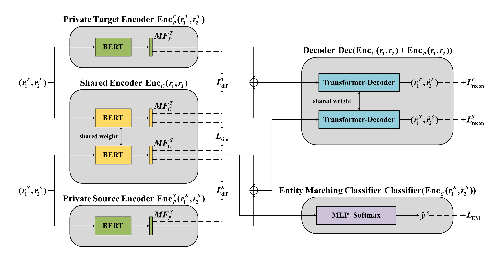
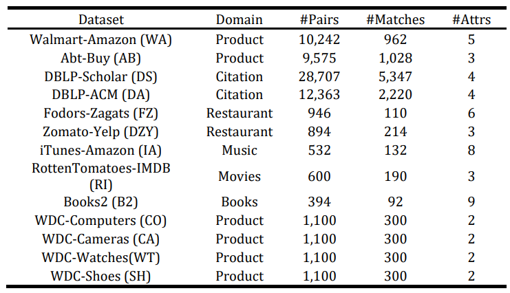

## MFSN-DAEM

Matching Feature Separation Network for Domain Adaptation in Entity Matching



This repository contains six implementations of the MFSN-DAME architectures described in the paper: MFSN-basic-mmd, MFSN-basic-k_order, MFSN-basic-grl, MFSN-FRSE-mmd, MFSN-FRSE-k_order and MFSN-FRSE-grl.

### 1. Installation

Install Pytorch (>= 1.13.0)

```
pip install pytorch
```

Install Python (>= 3.8)

```
pip install python 3.8
```

Install Numpy

```
pip install numpy
```

Install Pandas

```
pip install pandas
```

Install Matplotlib

```
pip intsall matplotlib
```

Install Sklearn

```
pip install scikit-learn
```

Install Transformers

```
pip install transformers
```

### 2. Datasets

 The datasets used in the paper are from [ruc-datalab/DADER](https://github.com/ruc-datalab/DADER).  The statistical information for all datasets is as follows:



### 3. How to use

We will demonstrate how to run 'MFSN-basic-mmd'. Similar steps can be followed to run other implementations.

1. Navigate to the 'main' directory.

   ```
   cd ./MFSN-basic/MFSN-basic-mmd
   ```

2. run the code:

   ```
   python train.py --parameters
   ```

   parameters settings:

   + src: The source domain dataset. type="string", default="b2"
   + tgt: The target domain dataset. type="string",default="fz"
   + num_epochs: The number of epochs. type="int", default=60
   + sim_weight: the weight of similarity loss. type="float", default=0.1
   + dif_weight: the weight of difference loss. type="float", default=1.0
   + rec_weight: the weight of reconstruction loss. type="float", default=0.05

3. We provide scripts to run 'MFSN-basic-mmd' on all tasks:

   ```
   python run_all.py
   ```

4. The metrics used for evaluation are  precision (P), recall (R), and F1 score (F). The results are saved in the 'result_basic_mmd' folder.